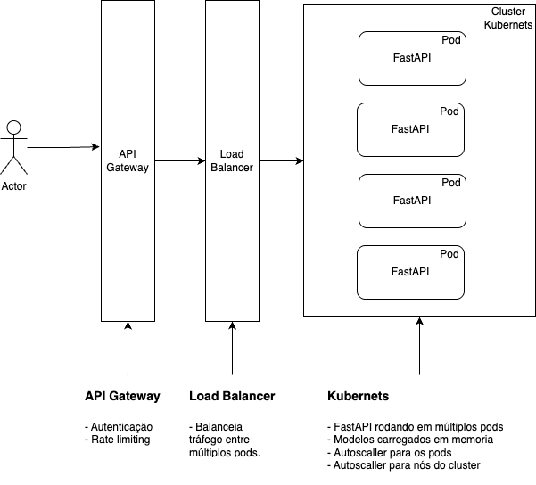
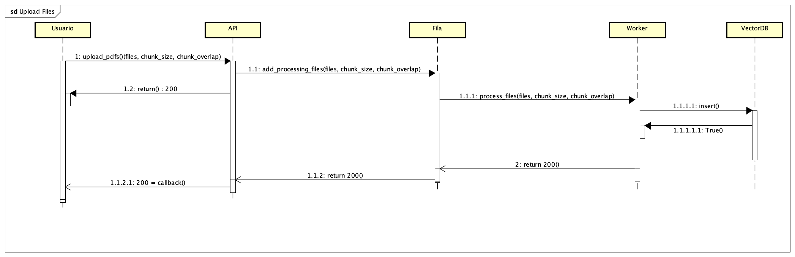

# Teste Cientista de Dados CGU

Deve ser construida uma API utilizando FastAPI com três endpoints principais, conforme
especificado abaixo.

- Upload de PDF: Receber arquivos, realizar o processamento de dados, criação de embeddnigs e indexação em banco vetorial
- naive-RAG: Receber uma pergunta e retornar a resposta adequada baseada nos documentos indexados.
- RAG: Receber uma pergunta e retornar a resposta adequada baseada nos documentos indexados. Diferença para o naive-RAG foi a utilização de recursos avançados para garantir a qualidade da resposta.
- Classificador de sentimentos: Receber uma sentença e classificar usando LLM ou SLM. Preferencialmente, utilizar logprobs para fundamentar a classificação

## Arquivos de teste

Para testar os serviços de upload dos arquivos e de RAG para responder com base nesse contexto, foram "impressos" em PDF algumas páginas da web com definições sobre MLOps. A ideia é que o RAG consiga responder sobre esse assunto. Os arquivos estão disponíveis na pasta `pdfs_para_tests/`.

## Arquitetura proposta



### API Gateway

O API Gateway é uma camada intermediária entre clientes e serviços de backend, centralizando a gestão de requisições e funções críticas como autenticação, autorização, rate limiting, roteamento e segurança. Ele atua como ponto único de entrada para todas as chamadas de API.

Vantagens:
  - Implementa OAuth2, JWT e Criptografia HTTPS, garantindo autenticação robusta e proteção dos dados em trânsito.

  - Configura rate limiting, prevenindo ataques DDoS e abusos de requisições.

  - Isola as camadas de aplicação e banco de dados, mantendo os serviços internos protegidos e ocultos do público. 


### Load Balancer

O Load Balancer distribui o tráfego de forma equilibrada entre múltiplos pods, servidores ou instâncias da aplicação, otimizando recursos e garantindo disponibilidade.

Vantagens:
- Evita sobrecarga em um único servidor, o que poderia comprometer o desempenho e causar indisponibilidades. 

- Facilita a escalabilidade horizontal, com adição ou remoção de instâncias de forma transparente para o cliente.

- Aumento da resiliência e disponibilidade. Caso uma instância falhe, o Load Balancer automaticamente redireciona as requisições para outros servidores saudáveis, garantindo a continuidade do serviço.

### Camada de aplicação:

#### API Layer 

A API Layer é o núcleo responsável por receber, processar e responder às requisições dos clientes. Nesta camada, a API (FastAPI) é executada em um cluster Kubernetes, distribuída em múltiplos pods para garantir alta escalabilidade, disponibilidade e tolerância a falhas.

Vantagens: 
- Capacidade de escalar horizontalmente, aumentando ou diminuindo a quantidade de pods automaticamente de acordo com a demanda.

- Cada pod pode aproveitar ao máximo os recursos da máquina que o hospeda ao utilizar múltiplos workers (de API), garantindo melhor desempenho no processamento das requisições.

- Suporte a processamento síncrono e assíncrono, com filas (Queue) para tarefas pesadas e assíncronas.


- Essa abordagem garante eficiência, alta performance e resiliência, além de possibilitar o escalonamento tanto de pods quanto de nós (máquinas) do cluster Kubernetes. Com isso, o sistema consegue lidar com grandes volumes de tráfego sem comprometer a qualidade do serviço.

#### Queue (Fila)

É responsável por gerenciar tarefas assíncronas que não precisam ser processadas imediatamente pela API, permitindo que operações mais pesadas sejam executadas em segundo plano por workers especializados. Ao intermediar a comunicação entre a camada de API e os workers, a fila garante que o sistema continue responsivo mesmo sob alta carga, evitando bloqueios e lentidão.

#### Workers

É composta por pods especializados e dedicados dentro do cluster Kubernets e são responsáveis por executar tarefas complexas e demoradas que são delegadas pela fila (Queue). São configurados com GPU própria para realizar a execução inferência de modelos LLM (Large Language Models).

Vantagens:

- Execução paralela de workloads pesadas (ex.: upload ou geração de respostas via LLM).

- Aproveitamento de GPU, acelerando inferências e tarefas de IA.

- Escalabilidade independente, ajustando a quantidade de workers sem afetar a API.


#### VectorDB

A camada de VectorDB é responsável por armazenar e gerenciar representações vetoriais (embeddings) de documentos, textos ou outros dados, permitindo buscas semânticas altamente eficientes e precisas. 

A ferramenta utilizada foi o ChromaDB, um banco de dados vetorial otimizado para operações de similaridade, essencial em aplicações que envolvem LLMs (Large Language Models) e RAG (Retrieval-Augmented Generation).

## Exemplo de Operação Assíncrona


Neste exemplo, é ilustrado o fluxo de execução do serviço de upload de arquivos. Como o envio e o processamento dos arquivos podem ser operações pesadas e demoradas, foi adotado um fluxo assíncrono para manter a API sempre disponível. Assim, ao receber o arquivo, o endpoint de upload retorna uma resposta de sucesso (HTTP 200) confirmando o recebimento, enquanto a requisição é enviada para a fila de processamento.

A fila gerencia o momento adequado para iniciar o processamento, direcionando a tarefa para um worker especializado, responsável pelas etapas de chunkização, geração de embeddings e armazenamento no banco vetorial (VectorDB). Ao finalizar o processamento, a API é notificada por meio de um serviço de callback, informando a conclusão com sucesso.

## LLM, RAG e afins

- Biblioteca majoritariamente utilizada: `Langchain`

O LangChain foi escolhido por ser amplamente utilizado como biblioteca para aplicações RAG, fornecendo abstrações de alto nível que facilitam a construção de pipelines com LLMs, desde a preparação de dados (splitters e embeddings) até a orquestração de respostas oriundas do modelo LLM.

- Modelo LLM para responder questões: `llama3.1` usando a biblioteca `Ollama`.

O Llama 3.1 é amplamente utilizado e foi escolhido por ter custo zero por uso, podendo ser executado na máquina local e tento qualidade comparável a modelos pagos. Por ter execução local, garante menor latência e maior controle de dados sensíveis. Além disso, tem boa integração com a biblioteca usada para o RAG, o LangChain, a partir do uso do Ollama.

- Modelo LLM para classificar sentimentos: `llama3.1` ou `OpenAI`.

Llama 3.1 é um modelo amplamente adotado na comunidade, com a vantagem de ser gratuito e de código aberto. Pode ser executado localmente, o que elimina custos com API, e apresenta uma qualidade comparável à de modelos comerciais.

OpenAI oferece modelos pagos, reconhecidos por sua alta performance e robustez. Tem fácil integração via API e ampla documentação.

- Chuknização: `RecursiveCharacterTextSplitter`

Esse splitter é recomendado pela documentação do LangChain por ser flexível e otimizado para lidar com textos de diferentes tamanhos, respeitando limites de tokens do modelo. Ele divide os documentos em partes menores (chunks) de forma hierárquica, buscando preservar a estrutura semãntica, o que melhora a relevância dos chunks para uso na recuperação de informações (RAG). 

- Geração de embeddings: modelo `sentence-transformers/all-MiniLM-L6-v2`

Este modelo é amplamente utilizado no mercado gerando embeddings semânticos de alta qualidade com baixo custo computacional. É ideal para aplicações de RAG, pois mantém performance robusta mesmo em hardware limitado, podendo ser executado em máquina local.

- Banco vetorial: ChromaDB

O ChromaDB é o banco vetorial padrão do ecossistema LangChain, amplamente testado e documentado. Sua integração com LangChain garante facilidade de implementação, suporte para persistência local e velocidade na busca por dados.


## API 

API com três serviços diferentes detalhados abaixo:

Serviços:

### Upload

- [POST] /upload/

Serviço para upload de arquivos .pdf, chunknização, geração de embeddings e armazenamento vetorial. Além dos arquivos .pdf de entrada, o serviço recebe parametros para configuração da chunknização.

Parametros:
   
    - files: array<string> (required)
    - chunk_size: integer
    - chunk_overlap: integer

Resposta [200]:

```
{
  "status": "success",
  "loaded_files": [
    "file_name_1.pdf",
    "file_name_2.pdf"
  ]
}
```

### Naive-RAG

O naive-rag é um serviço simples de RAG (Retrieval-Augmented Generation) baseado em LLaMA 3.1. Ele realiza a recuperação de contexto relevante e gera respostas fundamentadas em documentos usando um pipeline direto e eficiente.

#### Como funciona

1. Entrada:
O usuário fornece uma pergunta em linguagem natural.
Opcionalmente, pode ser ativado o rerank com BM25 para refinar a ordem dos documentos recuperados.

2. Recuperação de contexto:
O sistema consulta um vetorstore (ChromaDB) usando embeddings para buscar os k=5 documentos mais semanticamente relevantes.
Se o rerank com BM25 estiver ativado, os resultados são reordenados com base em similaridade lexical tradicional.

3. Geração da resposta:
  Um modelo LLM (LLaMA 3.1) recebe o contexto recuperado e a pergunta original.
  A resposta é gerada com base apenas nesse conteúdo — sem acesso externo.

#### Tecnologias utilizadas
- ChromaDB: banco vetorial persistente para armazenar e consultar embeddings de documentos.
- LLaMA 3.1: modelo de linguagem local usado para gerar a resposta final.
- BM25 (opcional): método de reranqueamento lexical para maior precisão em certos contextos.

#### Diferença entre os serviços:

- full_database: Utiliza todo banco vetorial como contexto para geração da resposta.
- by_filename: Utiliza só o registro do arquivo indicado no campo "filename" como contexto para geração da resposta.

#### Serviços:

- [GET] /naive-RAG/full_database

Parametros:
   
    - question: string (required)
    - bm25: boolean

Resposta [200]:

```
{
  "answer": "resposta"
}
```

- [GET] /naive-RAG/by_filename

Parametros:
   
    - question: string (required)
    - filename: string
    - bm25: boolean

Resposta [200]:

```
{
  "answer": "resposta"
}
```

### RAG

Esta seção um RAG (Retrieval-Augmented Generation) usando o framework LangGraph para organizar o fluxo com dois agentes inteligentes:

1. Agente Gerador:
Recebe uma pergunta do usuário, consulta um banco vetorial (ChromaDB) com documentos previamente indexados, e gera várias respostas alternativas usando um modelo LLM (como LLaMA 3.1).

2. Agente Avaliador:
Analisa as respostas geradas e escolhe a melhor resposta com base em critérios como clareza, precisão e relevância.

Esses dois agentes são conectados por meio de um grafo de estados (LangGraph) que define a ordem das etapas:

```
Usuário → Geração de Respostas → Avaliação → Resposta Final
```

#### Tecnologias usadas:
- LangChain: para criação de agentes e integração com LLMs.
- LangGraph: para controlar o fluxo dinâmico entre os agentes.
- ChromaDB: como banco de vetores para recuperação de contexto relevante.
- LLMs (como LLaMA 3.1): para gerar e avaliar respostas com base nos documentos.

#### Diferença entre os serviços:

- full_database: Utiliza todo banco vetorial como contexto para geração e avaliação.
- by_filename: Utiliza só o registro do arquivo indicado no campo "filename" como contexto para geração e avaliação.

#### Serviços:

- [GET] /rag/full_database

Parametros:
   
    - question: string (required)
    - bm25: boolean

Resposta [200]:

```
{
  "answer": "resposta"
}
```

- [GET] /rag/by_filename

Parametros:
   
    - question: string (required)
    - filename: string
    - bm25: boolean

Resposta [200]:

```
{
  "answer": "resposta"
}
```

### Classify

O método classify tem como objetivo analisar o sentimento de uma sentença em linguagem natural. Ele retorna tanto a classificação principal (positivo, neutro ou negativo), quanto as probabilidades associadas a cada classe.

#### Como funciona

1. Entrada:
  - Uma sentença de texto (string).
  - Modelo utilizado: OpenAI ou LLaMA 3.1.
  - Opcionalmente, uma chave de API da OpenAI (openai_api_key) para escolha do modelo.

2. Processamento:
O texto é analisado por um prompt estruturado para classificação de sentimentos.

3. Saída:
A classe predominante do sentimento: "positivo", "neutro" ou "negativo".
As probabilidades estimadas para cada classe.


#### Tecnologias utilizadas
- llama3.1: executado localmente, ideal para uso offline ou privado.
- OpenAI: se openai_api_key for fornecida, usa GPT-4 ou similar.
- Prompt engineering: Estrutura de instrução clara para garantir saída em formato JSON com rótulo e probabilidades.

#### Serviços

- [TODO][POST] /classify/

Parametros:
 ```  
{
  "input_data": "string",       # Frase para classificacao do sentimento
  "model": "string",            # openai ou llama3.1
  "openai_api_key": "string"    # Caso model = openai, entre com api_key
}
```
Resposta [200]:

```
{
  "sentimento": "negativo",
  "probabilidades": [
    {
      "classe": "positivo",
      "probabilidade": 0.05
    },
    {
      "classe": "negativo",
      "probabilidade": 0.85
    },
    {
      "classe": "neutro",
      "probabilidade": 0.1
    }
  ]
}
```


## Instalação e execução da API

Para instalar e executar o ambiente criado.
```
conda env create -f environment.yaml
conda activate test_cd_cgu
```

Para executar a API
```
uvicorn main:app --port 8080 --workers 4 
```

Para acesssar a documentação Swagger criada automaticamente pelo FastAPI:

```
http://localhost:8080/docs
```

Nessa documentação poderão ser realizados testes de execução da API

## Referências para implementação

  - LLM e API
    
    Projeto pessoal para criação de chat que tem como objetivo responder sobre espiritismo a partir de livros de Allan Kardec carregados como contexto do RAG. 
  
    Link: https://github.com/arrudamichel/project__spiritism_chat

- API
  -  Projeto pessoal para criação de chat que tem como objetivo responder sobre espiritismo a partir de livros de Allan Kardec carregados como contexto do RAG. 
  
      Link: https://github.com/arrudamichel/project__spiritism_chat

  - Projeto de dissertação que auxiliei na elaboração de uma API com FastAPI para upload de imagens, processamento e retorno das emoções que as cores expressavam.
  
      Link: https://github.com/airinecarmo/api-emotion-colors-images

- BM25

  Dissertação de mestrado: Usei BM25 como baseline comparativo para as técnicas propostas na dissertação.

  Link: https://www.cos.ufrj.br/uploadfile/publicacao/2921.pdf
