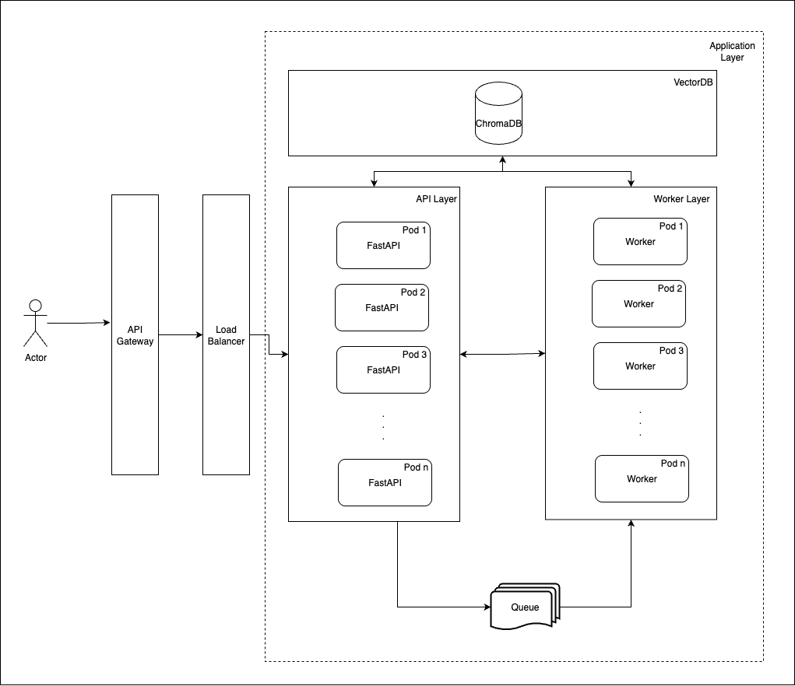

# Teste Cientista de Dados CGU

Deve ser construida uma API utilizando FastAPI com três endpoints principais, conforme
especificado abaixo.

- Upload de PDF: Receber arquivos, realizar o processamento de dados, criação de embeddnigs e indexação em banco vetorial
- naive-RAG: Receber uma pergunta e retornar a resposta adequada baseada nos documentos indexados.
- Classificador de sentimentos: Receber uma sentença e classificar usando LLM ou SLM. Preferencialmente, utilizar logprobs para fundamentar a classificação

## Arquivos de teste

Para testar os serviços de upload dos arquivos e de RAG para responder com base nesse contexto, foram "impressos" em PDF algumas páginas da web com definições sobre MLOps. A ideia é que o RAG consiga responder sobre esse assunto. Os arquivos estão disponíveis na pasta `pdfs_para_tests/`.

## Arquitetura proposta



- Camada de API Gateway: 

  Camada para aplicação da autentição e rate limiting, visando controlar a quantidade de requisições que um cliente pode fazer para uma API, evitando DDOS.

- Camada Load Balancer:

  Camada de Load Balancer para balancear o trafego de requisiçõeses entre os pods do Kubernets.

- Camada de aplicação:

  Camada de aplicação é executada dentro de um cluster kubernets, onde a API é executada em multiplos pods, possibilitando o autoscaller automático para pods e nós do cluster.

  Além disso, a API pode ser configurada para utilizar multiplos workers com objetivo de maximizar uso dos recursos de CPU de cada pod.

## LLM, RAG e afins

- Para chuknização foi utilizado o `RecursiveCharacterTextSplitter` do Langchain para dividir o texto em chunks (tokens).
- Para embeddings foi utilizado o modelo `sentence-transformers/all-MiniLM-L6-v2`
- Para banco vetorial foi utilizado o ChromaDB que é padrão da documentação do Langchain. 
- Biblioteca majoritariamente utilizada: ``Langchain
- LLM para responder questões: `llama3.1` usando a biblioteca `Ollama`.

## API 

API com três serviços diferentes detalhados abaixo:

Serviços:

- [POST] /upload/

Serviço para upload de arquivos .pdf, chunknização, geração de embeddings e armazenamento vetorial. Além dos arquivos .pdf de entrada, o serviço recebe parametros para configuração da chunknização.

Parametros:
   
    - files: array<string> (required)
    - chunk_size: integer
    - chunk_overlap: integer

Resposta [200]:

```
{
  "status": "success",
  "loaded_files": [
    "file_name_1.pdf",
    "file_name_2.pdf"
  ]
}
```

- [GET] /rag/

Parametros:
   
    - question: string (required)
    - bm25: boolean

Resposta [200]:

```
{
  "answer": "resposta"
}
```

- [TODO][POST] /classify/

Parametros:
   
    - input_data: string (required)

Resposta [200]:

```
{
  "classification": "positive",
  "probability": 0.8
}
```


## Instalação e execução da API

Para instalar e executar o ambiente criado.
```
conda env create -f environment.yaml
conda activate test_cd_cgu
```

Para executar a API
```
uvicorn main:app --port 8080 --workers 4 
```

Para acesssar a documentação Swagger criada automaticamente pelo FastAPI:

```
http://localhost:8080/docs
```

Nessa documentação poderão ser realizados testes de execução da API

## Referências para implementação

  - LLM e API
    
    Projeto pessoal para criação de chat que tem como objetivo responder sobre espiritismo a partir de livros de Allan Kardec carregados como contexto do RAG. 
  
    Link: https://github.com/arrudamichel/project__spiritism_chat

- API
  -  Projeto pessoal para criação de chat que tem como objetivo responder sobre espiritismo a partir de livros de Allan Kardec carregados como contexto do RAG. 
  
      Link: https://github.com/arrudamichel/project__spiritism_chat

  - Projeto de dissertação que auxiliei na elaboração de uma API com FastAPI para upload de imagens, processamento e retorno das emoções que as cores expressavam.
  
      Link: https://github.com/airinecarmo/api-emotion-colors-images

- BM25

  Dissertação de mestrado: Usei BM25 como baseline comparativo para as técnicas propostas na dissertação.

  Link: https://www.cos.ufrj.br/uploadfile/publicacao/2921.pdf